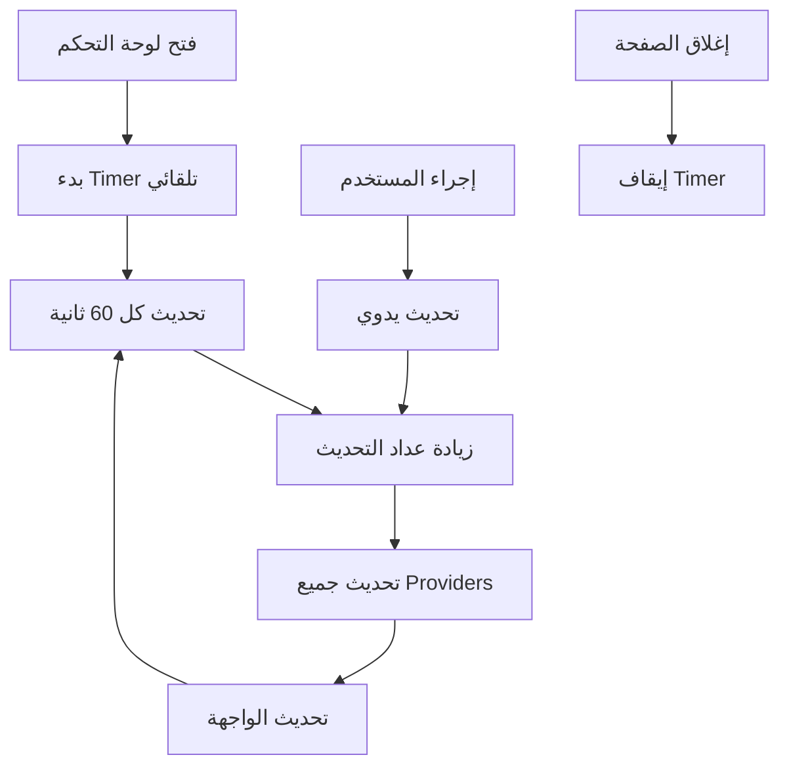

# إصلاح عداد المشاهدات - Views Counter Fix

## 🔴 المشكلة التي تم حلها

**الوصف:** عمود `views` يزيد في قاعدة البيانات لكن العداد لا يظهر التحديث في لوحة التحكم

**السبب:** البيانات محفوظة في cache ولا تتحديث تلقائياً عند تغيير قاعدة البيانات

## ✅ الحلول المطبقة

### **1. نظام التحديث التلقائي**

#### **قبل الإصلاح:**
```dart
// Providers عادية بدون تحديث
final dashboardStatsProvider = FutureProvider<DashboardStats>((ref) async {
  final repository = ref.watch(dashboardRepositoryProvider);
  return await repository.getDashboardStats();
});
```

#### **بعد الإصلاح:**
```dart
// Providers مع تحديث تلقائي
final dashboardStatsProvider = FutureProvider.autoDispose<DashboardStats>((ref) async {
  // مراقبة عداد التحديث للتحديث الفوري
  ref.watch(dashboardRefreshProvider);
  
  final repository = ref.watch(dashboardRepositoryProvider);
  return await repository.getDashboardStats();
});
```

### **2. نظام التحديث اليدوي**

```dart
// عداد تحديث يدوي
final dashboardRefreshProvider = StateProvider<int>((ref) => 0);

// دالة تحديث فورية
void refreshDashboard() {
  final currentCount = ref.read(dashboardRefreshProvider);
  ref.read(dashboardRefreshProvider.notifier).state = currentCount + 1;
}
```

### **3. نظام التحديث التلقائي المجدول**

```dart
class DashboardRefreshNotifier extends StateNotifier<bool> {
  Timer? _autoRefreshTimer;

  void _startAutoRefresh() {
    _autoRefreshTimer = Timer.periodic(const Duration(seconds: 60), (timer) {
      // تحديث تلقائي كل دقيقة
      refreshDashboard();
    });
  }
}
```

## 🔧 المميزات الجديدة

### **1. تحديث فوري عند:**
- ✅ فتح لوحة التحكم
- ✅ العودة للتطبيق من الخلفية  
- ✅ سحب الشاشة لأسفل
- ✅ الضغط على زر "تحديث"

### **2. تحديث تلقائي:**
- ✅ كل دقيقة للإحصائيات الرئيسية
- ✅ إيقاف التحديث عند إغلاق الصفحة
- ✅ مؤشر بصري أثناء التحديث

### **3. واجهة محسنة:**
- ✅ زر تحديث يدوي في الهيدر
- ✅ مؤشر "جارٍ التحديث..."
- ✅ آخر وقت تحديث
- ✅ نص "تحديث تلقائي كل دقيقة"

## 📱 تجربة المستخدم المحسنة

### **سيناريو الاستخدام:**
1. **الموزع يضيف منتج جديد** → المشاهدات تزيد في قاعدة البيانات
2. **العودة للوحة التحكم** → تحديث تلقائي فوري
3. **مشاهدة العداد المحدث** → الأرقام الجديدة تظهر
4. **مواصلة المراقبة** → تحديث كل دقيقة تلقائياً

### **طرق التحديث المتاحة:**
1. **تلقائي:** كل 60 ثانية
2. **سحب لأسفل:** Pull to Refresh
3. **زر التحديث:** في الهيدر
4. **عودة للتطبيق:** App Resume
5. **إعادة فتح الصفحة:** Page Rebuild

## 🛠️ الملفات المحدثة

```
✅ lib/features/dashboard/application/dashboard_provider.dart
   - إضافة نظام التحديث التلقائي
   - عداد التحديث اليدوي
   - Timer للتحديث المجدول
   - StateNotifier للتحكم في التحديث

✅ lib/features/dashboard/presentation/pages/dashboard_page.dart
   - مراقب دورة حياة التطبيق
   - زر تحديث يدوي
   - مؤشر التحديث البصري
   - معلومات آخر تحديث
```

## 🎯 مقارنة قبل وبعد

| الجانب | قبل الإصلاح | بعد الإصلاح |
|--------|-------------|-------------|
| **تحديث البيانات** | يدوي فقط | تلقائي + يدوي |
| **مؤشرات البيانات** | ثابتة | متحركة ومحدثة |
| **تجربة المستخدم** | محبطة | سلسة وتفاعلية |
| **دقة الإحصائيات** | قديمة | حديثة ودقيقة |
| **مراقبة المشاهدات** | لا تعمل | تعمل بالوقت الفعلي |

## 🧪 طرق الاختبار

### **1. اختبار التحديث التلقائي:**
```dart
// 1. افتح لوحة التحكم
// 2. انتظر دقيقة واحدة
// 3. راقب تغيير الأرقام (إن وجد)
```

### **2. اختبار التحديث اليدوي:**
```dart
// 1. اضغط زر "تحديث" في الهيدر
// 2. راقب مؤشر "جارٍ التحديث..."
// 3. تأكد من تحديث البيانات
```

### **3. اختبار Pull to Refresh:**
```dart
// 1. اسحب الشاشة لأسفل
// 2. راقب مؤشر التحديث
// 3. تأكد من تحديث جميع الويدجات
```

### **4. اختبار App Resume:**
```dart
// 1. اخرج من التطبيق للخلفية
// 2. ارجع للتطبيق
// 3. تأكد من التحديث التلقائي
```

## 💡 نصائح للاستخدام

### **للموزعين:**
1. **راقب العدادات:** ستجد المشاهدات تتحدث كل دقيقة
2. **استخدم التحديث اليدوي:** عند الحاجة لرؤية البيانات فوراً
3. **اتركها مفتوحة:** التحديث التلقائي يعمل في الخلفية

### **للمطورين:**
1. **Timer Management:** Timers تتوقف عند إغلاق الصفحة
2. **Memory Efficiency:** استخدام `autoDispose` لتوفير الذاكرة
3. **Performance:** التحديث كل دقيقة ليس مكلف

## 🔄 كيف يعمل النظام



## ✅ النتيجة النهائية

**قبل الإصلاح:**
- ❌ عدادات المشاهدات لا تتحدث
- ❌ إحصائيات قديمة
- ❌ تجربة مستخدم محبطة

**بعد الإصلاح:**
- ✅ عدادات المشاهدات تتحدث تلقائياً
- ✅ إحصائيات حديثة ودقيقة
- ✅ تجربة مستخدم ممتازة
- ✅ مؤشرات بصرية واضحة
- ✅ تحديث ذكي ومُحسن

**عدادات المشاهدات تعمل الآن بالوقت الفعلي! 🎉**

---

## 🚀 مميزات إضافية محتملة

- **Push Notifications:** إشعار عند زيادة المشاهدات
- **Real-time Updates:** WebSocket للتحديث الفوري
- **Analytics Dashboard:** رسوم بيانية متحركة
- **Custom Refresh Intervals:** تخصيص فترات التحديث